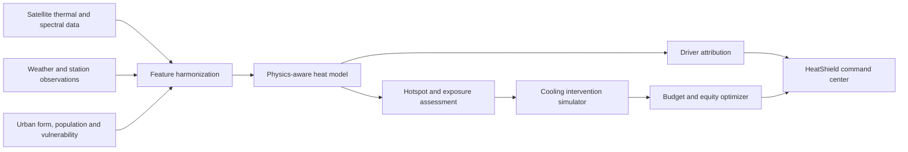

# HeatShield — Urban Heat Mitigation AI

An end-to-end geospatial decision-support platform for identifying urban heat hotspots, explaining heat-stress drivers, simulating cooling interventions, and optimizing city-wide mitigation portfolios under budget and equity constraints.

Built for Problem Statement 1 of the **Bharatiya Antariksh Hackathon 2026**:

> **Optimizing Urban Heat Mitigation and Cooling Strategies via Artificial Intelligence and Machine Learning (AI/ML)**

## What is implemented

- Interactive Next.js urban-climate command center
- 48-zone reproducible demonstration city with four map layers
- Physics-guided air-temperature and apparent-temperature baseline
- Heat hotspot, UHI intensity, exposure, and vulnerability scoring
- Local driver attribution across surface heating, morphology, vegetation, reflectance, ventilation, blue infrastructure, and anthropogenic heat
- Six cooling interventions: street trees, cool roofs, green roofs, permeable surfaces, blue corridors, and waste-heat reduction
- Before/after cooling, risk, exposure, and indicative cost estimates
- Budget-constrained, vulnerability-weighted portfolio optimizer
- FastAPI service with typed contracts and OpenAPI documentation
- Synthetic gradient-boosting training benchmark and feature importance
- Python and frontend-engine test suites
- Docker Compose deployment and GitHub Actions quality gates
- Architecture, methodology, data, API, and model-card documentation

## Product workflow



## Application capabilities

| Workspace | Capability |
| --- | --- |
| City overview | Mean modeled air temperature, UHI intensity, exposed population, and critical-zone count |
| Heat map | Risk, temperature, canopy, and vulnerability layers over a selectable 6×8 city grid |
| Zone intelligence | Apparent temperature, local risk, exposed population, land-cover metrics, and dominant heat drivers |
| Scenario lab | Intervention type and coverage controls with instant before/after estimates |
| Portfolio planner | Vulnerability-weighted cooling allocation under a configurable capital budget |
| Priority watchlist | Highest-risk zones ranked by thermal and exposure conditions |

## Quick start

```bash
cp .env.example .env
docker compose up --build
```

Open the web application at `http://localhost:3000` and the API explorer at `http://localhost:8000/docs`.

For local development:

```bash
python -m venv .venv
source .venv/bin/activate
python -m pip install -e ".[dev]"
npm install
uvicorn services.api.app.main:app --reload --port 8000
```

Run the frontend in another terminal:

```bash
npm run dev
```

## API examples

Simulate 25% tree-canopy coverage in zone `Z30`:

```bash
curl -X POST "http://localhost:8000/v1/scenarios/simulate" \
  -H "Content-Type: application/json" \
  -d '{"zone_id":"Z30","intervention":"tree_canopy","coverage_fraction":0.25}'
```

Optimize a ₹75 crore mitigation portfolio:

```bash
curl -X POST "http://localhost:8000/v1/portfolios/optimize" \
  -H "Content-Type: application/json" \
  -d '{"budget_crore":75,"max_items_per_zone":2}'
```

## Demonstration data

The demonstration city is generated deterministically from seed `2026`. This enables the complete product workflow without redistributing restricted or large geospatial datasets. It **does not represent current observed conditions in Delhi**.

```bash
PYTHONPATH=ml python scripts/generate_demo_data.py
```

A production implementation should replace the generator with validated adapters for satellite LST and spectral indices, weather observations, land use and morphology, blue-green infrastructure, population vulnerability, and local intervention economics.

## Model strategy

The default model is deliberately interpretable and physics guided. It combines surface, weather, land-cover, urban-form, and anthropogenic-heat indicators; constrains predicted air temperature to plausible bounds; derives apparent temperature from humidity and wind; measures UHI intensity against a rural reference; and exposes signed driver contributions.

The training module supplies a gradient-boosting benchmark. On the bundled synthetic benchmark it produces approximately `0.30°C MAE` and `0.38°C RMSE`. These values validate the software pipeline and are **not field-performance claims**.

## Intervention optimization

Each cooling measure changes explicit physical or morphological features and reruns the same assessment model. The optimizer considers expected cooling, risk reduction, avoided exposure, social vulnerability, and cost, then selects an auditable portfolio under the available budget.

## Validation

```bash
pytest
node --test apps/web/tests/*.test.mjs
npm run typecheck
npm run lint
npm run build
```

Validated locally:

- 12 Python model, optimizer, and API tests
- 4 frontend heat-engine tests
- deterministic synthetic-data generation
- Python bytecode compilation

## Repository structure

```text
apps/web/                 Next.js heat operations workspace
services/api/             FastAPI service and HTTP schemas
ml/urban_heat/            Heat model, data, scenarios, optimizer, training
scripts/                  Data generation and training entrypoints
data/samples/             Reproducible demonstration-data guidance
tests/                    Python model, optimizer, and API tests
docs/                     Architecture, methodology, data, API, and model card
.github/workflows/        Continuous integration
```

## Responsible use

HeatShield is a planning and research prototype. Scenario outputs are modeled comparisons, not guaranteed causal cooling effects. Operational deployment requires local calibration, spatiotemporal validation, uncertainty analysis, engineering feasibility studies, cost validation, public-health review, community consultation, and post-implementation monitoring.

## License

MIT
