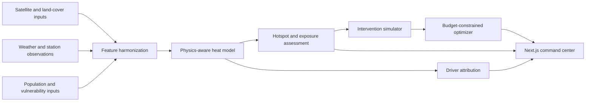

# System architecture

## Design goals

HeatShield is designed as a transparent decision-support system rather than a single opaque prediction endpoint. It separates observation, inference, scenario simulation, optimization, and presentation so that each layer can be validated and replaced independently.

## Current implementation

The repository includes a deterministic demonstration adapter that generates a 48-zone Delhi-inspired grid. It supports the complete product workflow without claiming that synthetic values are current observations.

- **Web application:** Next.js and React with a dependency-free map surface, layer switching, zone inspection, scenario controls, and portfolio planning.
- **API:** FastAPI contracts for city assessment, zone inspection, cooling simulation, and optimization.
- **Model package:** interpretable physics-guided baseline, reproducible data generator, intervention transformations, optimizer, and training benchmark.
- **Validation:** Python unit/API tests and Node-based frontend-engine tests.

## Production adapters

A deployment using observed data should add adapters for:

1. satellite land-surface temperature and vegetation/built-up indices;
2. weather stations or gridded reanalysis for air temperature, humidity, wind, and rural-reference conditions;
3. land-use, building morphology, road density, and blue-green infrastructure;
4. population density and vulnerability indicators at a defensible spatial resolution;
5. intervention cost, suitability, ownership, maintenance, and implementation constraints from the relevant urban authority.

The core contracts use zone-level feature records. Raster and vector processing can therefore evolve without forcing changes to the user interface or optimization response schema.

## Safety boundary

HeatShield ranks planning options; it does not establish causal effects or replace field studies. Production use requires local calibration, held-out spatiotemporal validation, uncertainty analysis, community consultation, engineering feasibility assessment, and post-intervention monitoring.
